---

🎓 I'm a Computer Engineering student at Mehmet Akif Ersoy University, expected to graduate in 2027.  
🧠 I’m learning about Artificial Intelligence and exploring its applications.  
💻 I am learning to develop web applications using Laravel, PHP, Vue.js, and modern frontend technologies.  
🛠️ I am practicing building backend systems and APIs with Python, C++, and FastAPI.  
🔍 I enjoy discovering new technologies and contributing to open-source projects.

📊 My WakaTime: [View My Coding Stats](https://wakatime.com/@ramazanyildirim)

---

## 📱 Connect with Me

  
  
  

---

## 🛠️ Tools & Technologies I Use

  

---

## 📊 GitHub Profile Stats

### 🔹 GitHub Metrics (Private Dahil)

  

---

### 🔹 GitHub Stats & Top Languages (Private Dahil)

  
  

---

### 🔹 GitHub Streak (Private Dahil)

  

---

### 🔹 Contribution Graph (Private Dahil)

  

---

### 🔹 GitHub Trophies

  

---

## 🐍 GitHub Snake Game (Private Dahil)

  <picture>
    <source media="(prefers-color-scheme: dark)" srcset="images/github-snake-dark.svg" />
    <source media="(prefers-color-scheme: light)" srcset="images/github-snake.svg" />
    
  </picture>

