<h1 align="center">Hi 👋, I'm Ramazan Yıldırım</h1>
<h3 align="center">A passionate frontend , python developer from Turkey</h3>

- 🔭 I’m currently working on *python*,

- 💻 I know HTML, CSS and Bootstrap

- 🌱 I’m currently learning *JavaScript*

- 👨‍💻 All of my projects are available at [https://github.com/Ramazan-yildirim?tab=repositories].

- 📫 How to reach me *ramazanyldr0103@gmail.com*

