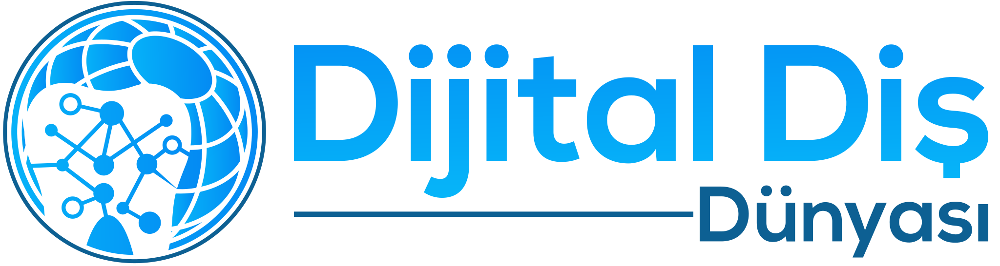

---

---

  <h1>Ramazan Yıldırım</h1>
  
<strong>Computer Engineering</strong> · Software Development · Artificial Intelligence

  
  
  

  
  
  <!-- TODO: Add the personal website URL when it is available. -->
  

---

## CV

<strong>View My CV</strong>

 

A CV preview and downloadable PDF are not stored in this repository yet.

- [View CV Repository](https://github.com/Ramazan-yildirim/CV_Portfolio)
- **TODO:** Add a CV preview image and downloadable PDF under `assets/cv/`.

## Portfolio

[View Portfolio](https://github.com/Ramazan-yildirim/CV_Portfolio)

<!-- TODO: Add a direct portfolio PDF download link when the file is available. -->

---

## Building

  

### Dijital Diş Dünyası

An integrated platform that brings dental clinics, laboratories, suppliers, patients, and industry professionals together across procurement, operations, communication, and AI-assisted workflows.

**Public frontend:** Vue.js · JavaScript · CSS 
**Live:** [dijitaldisdunyasi.com](https://dijitaldisdunyasi.com) 
Source repository is private.

---

## 👨‍💻 About Me

🎓 Computer Engineering student at Burdur Mehmet Akif Ersoy University, expected to graduate in 2027. 
🤖 Focused on deep learning, computer vision, and Turkish natural language processing. 
🧠 Building practical AI projects with PyTorch, Hugging Face Transformers, OpenCV, and MediaPipe. 
🌐 Developing backend and web applications with FastAPI, Laravel, PHP, and Vue.js. 
🚀 Interested in reproducible machine learning, real-world AI applications, and open-source development.

[Instagram](https://www.instagram.com/ramazan.yiildirim/) · [WakaTime](https://wakatime.com/@ramazanyildirim)

---

## 🛠️ Tech Stack

`Python` · `PyTorch` · `TensorFlow` · `Hugging Face` · `OpenCV` · `MediaPipe` · `C#` · `.NET` 
`FastAPI` · `Laravel` · `PHP` · `Vue.js` · `JavaScript` · `HTML` · `CSS` 
`Docker` · `Linux` · `Git` · `GitHub` · `PowerShell`

---

## 📊 GitHub Overview

  

## Languages

  

## Contributions

  

  

