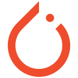
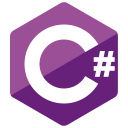
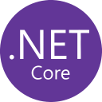
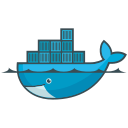
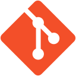

---

  
  
  

  
  

---

## 👨‍💻 About Me

🎓 Computer Engineering student, graduating in 2027. 
🤖 Focused on deep learning, computer vision, and Turkish NLP. 
💻 Building backend and web applications with FastAPI, Laravel, PHP, and Vue.js. 
🧩 Interested in practical, reproducible software and AI systems.

<strong>CV &amp; Portfolio</strong>

 

### CV

<table>
  <tr>
    <td align="center" width="50%">
      <strong>English CV</strong>  
      
    </td>
    <td align="center" width="50%">
      <strong>Türkçe CV</strong>  
      
    </td>
  </tr>
</table>

  
  

### Portfolio

<table>
  <tr>
    <td align="center" width="50%"></td>
    <td align="center" width="50%"></td>
  </tr>
</table>

  
  

---

  

  <strong>Co-Founder &amp; Developer</strong>

  <strong>An integrated digital platform for the dental ecosystem.</strong> 
  Connecting clinics, laboratories, suppliers, patients, and professionals across procurement, operations, communication, and AI-assisted workflows.

  

---

## 🛠️ Tech Stack

<table align="center">
  <tr>
    <td align="center" width="96"> Python</td>
    <td align="center" width="96"> PyTorch</td>
    <td align="center" width="96"> TensorFlow</td>
    <td align="center" width="96"> Hugging Face</td>
    <td align="center" width="96"> OpenCV</td>
  </tr>
  <tr>
    <td align="center"> MediaPipe</td>
    <td align="center"> C#</td>
    <td align="center"> .NET</td>
    <td align="center"> FastAPI</td>
    <td align="center"> Laravel</td>
  </tr>
  <tr>
    <td align="center"> PHP</td>
    <td align="center"> Vue.js</td>
    <td align="center"> JavaScript</td>
    <td align="center"> HTML5</td>
    <td align="center"> CSS3</td>
  </tr>
  <tr>
    <td align="center"> Docker</td>
    <td align="center"> Linux</td>
    <td align="center"> Git</td>
    <td align="center"> PowerShell</td>
    <td align="center"> GitHub</td>
  </tr>
</table>

---

## 📊 GitHub Overview

  

## Languages

  

---

## Contribution Snake

  <picture>
    <source media="(prefers-color-scheme: dark)" srcset="https://raw.githubusercontent.com/Ramazan-yildirim/Ramazan-yildirim/output/github-contribution-grid-snake-dark.svg">
    <source media="(prefers-color-scheme: light)" srcset="https://raw.githubusercontent.com/Ramazan-yildirim/Ramazan-yildirim/output/github-contribution-grid-snake.svg">
    
  </picture>

